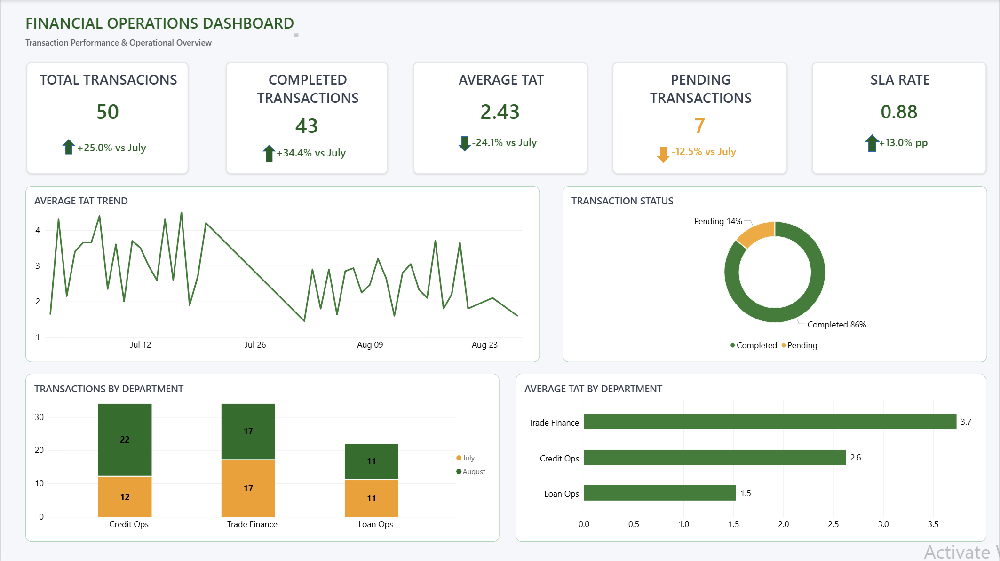

# Financial Operations Dashboard

A financial operations analytics project using **SQL Server and Power BI** to monitor transaction performance, processing efficiency, SLA compliance, and department workload.

---

## 1. Project Overview

This project analyzes simulated financial transaction data to evaluate operational performance across:

* Transaction volume and status
* Completed and pending transactions
* Turnaround Time (TAT)
* SLA performance
* Department workload
* Month-over-month performance

The project demonstrates an end-to-end workflow from **SQL data preparation and analysis to Power BI dashboard development and business insight generation**.

---

## 2. Business Objectives

The main objectives of this project are to:

* Monitor overall transaction volume and processing status.
* Compare operational performance between July and August 2026.
* Analyze transaction workload across departments.
* Monitor Average TAT and SLA Rate.
* Identify pending transactions and potential operational bottlenecks.
* Evaluate whether processing performance improved as transaction volume increased.
* Provide a management-level dashboard for operational performance monitoring.

---

## 3. Dataset

The dataset contains simulated financial operations transactions with the following fields:

| Column           | Description                           |
| ---------------- | ------------------------------------- |
| Transaction_ID   | Unique transaction identifier         |
| Date             | Transaction date                      |
| Customer_ID      | Customer identifier                   |
| Transaction_Type | Type of financial transaction         |
| Amount           | Transaction amount                    |
| Currency         | Transaction currency                  |
| Status           | Transaction processing status         |
| TAT              | Turnaround time in hours              |
| Channel          | Transaction channel                   |
| Department       | Department responsible for processing |

> **Note:** The dataset is simulated for portfolio and analytical practice purposes and does not contain real customer information.

---

## 4. Tools & Technologies

* **SQL Server** – Data storage, querying, validation and analysis
* **SQL** – Data preparation, data validation and KPI analysis
* **Power BI** – Dashboard development and data visualization
* **DAX** – KPI calculations and month-based analysis
* **Microsoft Excel** – Supporting data preparation and validation
* **Git/GitHub** – Version control and project documentation

---

## 5. Data & SQL Analysis

SQL was used to create the database, define the transaction table, insert transaction data, validate the dataset, and prepare analytical queries.

### Key SQL Analysis

* Transaction volume by month
* Completed vs. Pending transactions
* Transaction amount by transaction type
* Transaction volume by department
* Average TAT by department
* SLA performance
* Duplicate Transaction ID validation
* July vs. August performance comparison

### SQL Workflow

```text
Raw Transaction Data
        ↓
SQL Server Database
        ↓
Data Validation
        ↓
KPI & Performance Analysis
        ↓
Power BI
```

---

## 6. Key Performance Indicators

The Power BI dashboard tracks five main operational KPIs:

| KPI                    | Description                                     |
| ---------------------- | ----------------------------------------------- |
| Total Transactions     | Total number of transactions                    |
| Completed Transactions | Number of successfully completed transactions   |
| Pending Transactions   | Number of transactions still pending            |
| Average TAT            | Average turnaround time in hours                |
| SLA Rate               | Percentage of transactions processed within SLA |

---

## 7. Power BI Dashboard

The dashboard provides an overview of financial operations performance and enables analysis across transaction status, transaction type, department, and monthly performance.

### Dashboard Components

* KPI Cards
* July vs. August comparison
* Transaction status analysis
* Transaction volume by department
* Transaction type analysis
* Average TAT
* SLA performance
* Interactive filters and slicers

### Dashboard Preview



📄 **[View Dashboard PDF](./reports/Financial_Operations_Dashboard.pdf)**

---

## 8. Key Insights

### Transaction Volume

August recorded **50 transactions**, representing a **25% increase** from July's 40 transactions.

The increase indicates a higher operational workload during August and provides a basis for evaluating whether processing performance was able to keep pace with the additional transaction volume.

### Completion Performance

Completed transactions increased from **32 in July to 43 in August**, representing a **34.4% increase**.

The completion rate also improved from **80.0% to 86.0%**, indicating that a larger proportion of transactions were successfully completed despite the increase in overall workload.

### Pending Transactions

Pending transactions decreased from **8 to 7**, a **12.5% reduction**, even though total transaction volume increased by 25%.

This suggests improved transaction resolution and processing capacity, with fewer transactions remaining outstanding.

### SLA Performance

The **SLA Rate improved from 75% in July to 88% in August**, an increase of **13 percentage points**.

The improvement indicates stronger adherence to service-level targets and suggests that processing efficiency improved alongside the higher transaction volume.

### Turnaround Time

Average TAT decreased from **3.21 hours in July to 2.43 hours in August**, representing a **24.3% reduction**.

The shorter processing time, combined with the higher completion rate and improved SLA performance, indicates an overall improvement in operational efficiency.

### Department Performance

**Credit Ops** experienced the largest increase in transaction volume, rising from **12 transactions in July to 22 in August**, an **83.3% increase**.

In contrast:

* **Trade Finance:** remained stable at 17 transactions
* **Loan Ops:** remained stable at 11 transactions

Credit Ops was therefore the main driver of the additional operational workload in August.

### Overall Insight

Overall, August demonstrated **stronger operational performance despite a higher workload**.

| Metric                 |     July |   August |  Change |
| ---------------------- | -------: | -------: | ------: |
| Total Transactions     |       40 |       50 |  +25.0% |
| Completed Transactions |       32 |       43 |  +34.4% |
| Pending Transactions   |        8 |        7 |  -12.5% |
| Completion Rate        |    80.0% |    86.0% | +6.0 pp |
| SLA Rate               |      75% |      88% |  +13 pp |
| Average TAT            | 3.21 hrs | 2.43 hrs |  -24.3% |

The increase in Credit Ops volume was the main driver of the additional workload, while the improvement in completion rate, SLA performance, and TAT indicates that operations were able to handle the increased demand more efficiently.

---

## 9. Project Structure

```text
financial-operations-dashboard/
│
├── README.md
│
├── .gitignore
│
├── screenshots/
│   └── dashboards.png
│
├── power bi/
│   └── Financial_Operations_Dashboard.pbix
│
├── reports/
│   └── Financial_Operations_Dashboard.pdf
│
└── sql/
    ├── 01. create_database.sql
    ├── 02. create_table.sql
    ├── 03. insert july_data.sql
    ├── 04. insert august_data.sql
    ├── 05. analysis_queries.sql
    └── README.md
```

---

## 10. Skills Demonstrated

### Technical Skills

* SQL Server
* SQL querying & data analysis
* Data validation & data transformation
* DAX
* Power BI
* Microsoft Excel
* Git/GitHub

### Analytical Skills

* KPI development
* Month-over-month analysis
* SLA & TAT analysis
* Transaction performance analysis
* Department performance analysis
* Business insight generation

### Domain Knowledge

* Financial operations
* Transaction processing
* Credit operations
* Loan operations
* Operational performance monitoring

---

## 11. Portfolio Highlights

This project demonstrates the ability to:

* Build and manage a SQL Server database.
* Validate and analyze operational transaction data.
* Develop business-focused KPIs.
* Create an interactive Power BI dashboard.
* Perform month-over-month performance analysis.
* Translate operational data into actionable business insights.
* Document and manage an analytics project using Git/GitHub.
